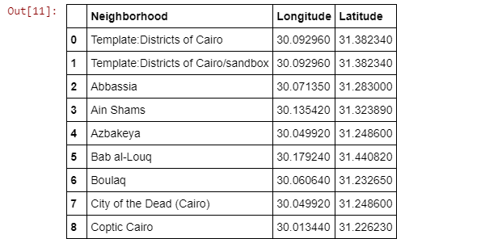
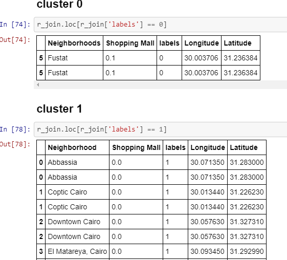

# BATTLE OF NEIGHBORHOOD

  The goal of this capstone project is to break down and choose the best areas in the Cairo,
  Egypt to open shopping center. Utilizing information science philosophy and AI methods
  like grouping, this venture intends to give answers for answer the business question: In
  Cairo, Egypt if a property designer is hoping to open another shopping center, where might
  you prescribe that they open it? 

## LIBRARY USED
  numpy  
  json
  pandas
  Nominatim
  geocoder
  BeautifulSoup
  matplotlib
  sklearn
  folium

## DATA SOURCE

  https://en.wikipedia.org/wiki/Category:Districts_of_Cairo

## SCREENSHOTS

